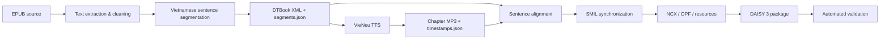

# DAISY 3 Voice Processing & Digital Talking Book Pipeline

End-to-end pipeline for converting Vietnamese EPUB content into an accessible **DAISY 3 digital talking book** with structured text, synthesized speech, sentence-level text-audio synchronization, hierarchical navigation, package metadata, and automated validation.

The implementation follows **DAISY 3 / ANSI-NISO Z39.86-2005** and **DTBook 2005-3**. The processing flow covers text extraction, Vietnamese text normalization, DTBook generation, neural text-to-speech, timing metadata, sentence-level alignment, SMIL synchronization, NCX navigation, OPF packaging, and package validation.

The reference corpus used during development is the Vietnamese edition of *Trong Gia Đình* (*En famille*) by Hector Malot, organized as an introduction plus 22 chapters.

## End-to-end pipeline



## Core capabilities

- EPUB chapter extraction and Vietnamese text cleaning.
- Sentence segmentation with stable IDs for downstream synchronization.
- DAISY 3 DTBook XML generation with structured metadata and SMIL references.
- Vietnamese speech synthesis with **VieNeu**, voice **Minh Đức**, ONNX backend.
- Context-aware TTS chunking to preserve paragraph-level prosody.
- TTS-specific normalization without modifying the original source text.
- Chapter-level MP3 generation with coarse timing metadata.
- Sentence-level alignment inside TTS context windows.
- CTC alignment using `nguyenvulebinh/wav2vec2-base-vietnamese-250h`.
- Proportional timing fallback when CTC alignment is unavailable or fails.
- SMIL generation with sentence-level `clipBegin` / `clipEnd` synchronization.
- DAISY navigation and package generation through `navigation.ncx`, `book.opf`, and `resources.res`.
- Stage-level validation for DTBook structure, TTS handoff integrity, audio timing, alignment, and package consistency.
- Pilot-first execution and per-chapter failure isolation for long-running batch processing.

## Processing stages

### 1. EPUB processing and DTBook generation

`src/run_task1.py` extracts each chapter from the EPUB source, cleans the text, segments Vietnamese sentences, generates DTBook XML, writes the handoff representation, and validates the generated structure.

Each chapter produces:

```text
results/task1/<chapter>/
├── dtbook.xml
└── segments.json
```

The intermediate `segments.json` preserves the identifiers required by the audio and synchronization stages:

```json
{
  "sent_id": "id_4",
  "smil_sid": "sid_4",
  "p_id": "c0_p1",
  "seq_id": "seq_1",
  "text": "..."
}
```

The complete text-processing run currently covers **23 sections** (introduction + 22 chapters), with **3,188 paragraphs** and **8,859 sentences** generated and validated.

### 2. Vietnamese TTS and audio processing

`src/tts/run_task2.py` converts sentence data into chapter-level speech using VieNeu.

Default TTS configuration:

| Setting | Value |
| --- | --- |
| Engine | VieNeu |
| Voice | Minh Đức |
| Backend | ONNX |
| Output | MP3, 128 kbps |
| Maximum context | 12 sentences / 900 characters |
| Same-paragraph chunk pause | 155 ms |
| Paragraph pause | 170 ms |
| Scene-break pause | 250 ms |

Consecutive sentences inside the same paragraph are grouped into context chunks to reduce unnatural sentence-by-sentence synthesis. A separate `tts_text` representation handles pronunciation-oriented normalization while the original `text` remains unchanged.

Each processed chapter produces:

```text
results/task2/<chapter>/
├── <chapter>.mp3
└── timestamps.json
```

`timestamps.json` stores the coarse audio timeline and the ordered mapping back to `sent_id`, `smil_sid`, `p_id`, `seq_id`, source text, and normalized TTS text.

The TTS runner also verifies source-file SHA-256 values before and after synthesis so Stage-1 artifacts remain read-only.

### 3. Sentence alignment and DAISY packaging

`src/daisy/run_task3.py` combines DTBook structure with generated audio and timing metadata.

Sentence timing is refined inside each TTS context window rather than realigning the entire chapter. CTC alignment is attempted first; unresolved chunks fall back to proportional splitting based on normalized text length.

Each generated DAISY package contains:

```text
results/task3/<chapter>/
├── dtbook.xml
├── <chapter>.mp3
├── alignment.json
├── mo0.smil
├── navigation.ncx
├── book.opf
└── resources.res
```

The SMIL layer links DTBook sentence anchors to exact audio intervals. Structural pauses remain inside the final sentence clip of a context chunk so playback does not skip intended silence.

## Data flow

```text
EPUB
  ↓
dtbook.xml + segments.json
  ↓
VieNeu TTS
  ↓
MP3 + timestamps.json
  ↓
CTC / proportional sentence alignment
  ↓
alignment.json
  ↓
SMIL + NCX + OPF + resources
  ↓
DAISY 3 package
```

The stage boundaries are intentionally explicit so generated data can be validated before entering the next stage.

## Current repository status

| Stage | Current state |
| --- | --- |
| Text extraction / DTBook | 23/23 sections generated |
| Text corpus | 3,188 paragraphs / 8,859 sentences |
| TTS implementation | Implemented |
| Committed TTS artifacts | Introduction + Chapters 1-12 |
| Alignment / DAISY package implementation | Implemented |
| Committed end-to-end DAISY packages | Introduction + Chapter 1 |
| Pilot DAISY validation | Passed |
| Full 23-section audio/package production | Not yet complete |
| Final reader-level QA / release packaging | Not finalized |

The repository demonstrates the complete end-to-end architecture and a validated pilot, while the remaining full-book production run depends on generating the outstanding chapter audio.

## Repository structure

```text
.
├── README.md
├── data/
│   └── trong_gia_dinh.epub
├── src/
│   ├── config.py
│   ├── extract_clean.py
│   ├── generate_dtbook.py
│   ├── validate_dtbook.py
│   ├── run_task1.py
│   ├── tts/
│   │   ├── normalize.py
│   │   ├── synthesize.py
│   │   ├── run_task2.py
│   │   ├── validate_task2.py
│   │   ├── requirements.txt
│   │   └── README.md
│   └── daisy/
│       ├── align.py
│       ├── clips.py
│       ├── build.py
│       ├── run_task3.py
│       ├── validate_task3.py
│       ├── requirements.txt
│       └── README.md
└── results/
    ├── task1/
    ├── task2/
    └── task3/
```

## Requirements

The full pipeline requires:

- Python 3.12 for the alignment environment.
- `ffmpeg` and `ffprobe` available on `PATH`.
- BeautifulSoup for EPUB/HTML extraction.
- VieNeu, pydub, and ONNX Runtime for TTS.
- PyTorch, torchaudio, and Transformers for CTC alignment.

Install the text-processing dependency:

```bash
python -m pip install beautifulsoup4
```

Install TTS dependencies:

```bash
python -m pip install -r src/tts/requirements.txt
ffmpeg -version
ffprobe -version
```

Install alignment dependencies:

```bash
py -3.12 -m venv .venv
.venv\Scripts\python -m pip install torch torchaudio --index-url https://download.pytorch.org/whl/cpu
.venv\Scripts\python -m pip install -r src/daisy/requirements.txt
```

## Running the pipeline

A pilot run is recommended before batch processing.

### Stage 1 — EPUB to DTBook

```bash
python src/run_task1.py --pilot
python src/run_task1.py --chapter 5
python src/run_task1.py --all
```

### Stage 2 — TTS and audio

```bash
python src/tts/run_task2.py --pilot
python src/tts/validate_task2.py --pilot

python src/tts/run_task2.py --chapter 5
python src/tts/validate_task2.py --chapter 5
```

Full production:

```bash
python src/tts/run_task2.py --all
python src/tts/validate_task2.py --all
```

### Stage 3 — Alignment and DAISY package

```bash
.venv\Scripts\python src/daisy/run_task3.py --pilot
.venv\Scripts\python src/daisy/validate_task3.py --pilot

.venv\Scripts\python src/daisy/run_task3.py --chapter 5
.venv\Scripts\python src/daisy/run_task3.py --all
```

A chapter without generated Stage-2 audio is reported independently and does not terminate processing of the remaining chapters.

## Validation strategy

Validation is performed at every pipeline boundary:

- **DTBook:** XML structure, sentence IDs, SMIL references, and document consistency.
- **TTS handoff:** sentence order, identifiers, paragraph boundaries, timestamps, audio readability, and source integrity.
- **Alignment:** exact/aligned/proportional timing modes recorded in `alignment.json`.
- **DAISY package:** timing ranges, resource references, generated package files, and synchronization consistency.

This makes the output auditable at each stage instead of relying only on final-package inspection.

## Public-data note

The reference EPUB, extracted book text, and generated speech are based on a published Vietnamese edition of *Trong Gia Đình*. Redistribution rights for source and derived content are separate from the implementation itself.

For a portfolio-oriented public repository, the safest distribution is the source code, configuration, documentation, and small non-copyrighted or authorized examples. Full source text, EPUB files, and generated chapter audio should only remain public when redistribution permission is confirmed.

## Detailed implementation notes

Stage-specific implementation details remain available in:

- `src/tts/README.md` — TTS configuration, context synthesis, and validation.
- `src/daisy/README.md` — sentence alignment, timing behavior, and DAISY package generation.
