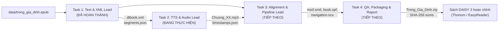

# HƯỚNG DẪN DÀNH CHO AI AGENT CODING & DEVELOPER
## Dự án: Sách Điện Tử DAISY 3 - Bộ Môn Xử Lý Tiếng Nói (K35)
## Tác phẩm: *Trong Gia Đình* (Hector Malot) | ISBN: `978-604-69-8175-6`

Tài liệu này quy định các tiêu chuẩn kiến trúc, quy tắc viết code, giao thức chuyển giao dữ liệu (handoff) và quy trình cập nhật trạng thái dành cho các **AI Coding Agent** (Antigravity, Cursor, Windsurf, Claude Code...) và thành viên phát triển tiếp theo của dự án.

---

## 1. Bối Cảnh Dự Án & Bản Đồ Nhiệm Vụ (Project Roadmap)

Dự án gồm **4 nhiệm vụ chính liên kết tuần tự** theo đường ống (pipeline):



### Bảng Trạng Thái Nhiệm Vụ:
* **Task 1 (Text & XML):** `[COMPLETED]` - Đã trích xuất và chuẩn hóa 23 chương, tạo `dtbook.xml` chuẩn DTBook 2005-3 và `segments.json`.
* **Task 2 (TTS & Giọng đọc):** `[IN PROGRESS]` - Sinh audio theo chương bằng VieNeu (`Minh Đức`, ONNX), giữ context theo paragraph và tạo metadata thời gian phục vụ forced alignment ở Task 3. Chapter 00 đã validation thành công.
* **Task 3 (Đồng bộ SMIL & Đóng gói DAISY):** `[PENDING / NEXT]` - Tạo `mo0.smil`, `book.opf`, `navigation.ncx`, `resources.res`.
* **Task 4 (Kiểm thử & Báo cáo):** `[PENDING / NEXT]` - Kiểm thử hiển thị chữ chạy trên Thorium Reader, nén zip và tạo mã băm SHA-256.

---

## 2. Quy Tắc Tổ Chức Thư Mục & Quản Lý Dữ Liệu

Tất cả các Agent **bắt buộc tuân thủ** cấu trúc phân tách rõ ràng:

```text
.
├── agent.md                # Quy chuẩn dành cho AI Agent Coding (tệp này)
├── README.md               # Bộ mặt dự án: Tổng quan, bảng phân công và trạng thái
├── .gitignore              # Tuyệt đối không commit cache, virtualenv, tệp tạm
├── data/                   # Chứa tài liệu nguồn nguyên bản (Read-only)
│   └── trong_gia_dinh.epub
├── src/                    # Toàn bộ mã nguồn Python thực thi
│   ├── config.py           # Cấu hình, metadata và đường dẫn dùng chung
│   ├── extract_clean.py    # (Task 1) Trích xuất EPUB, làm sạch và tách câu
│   ├── generate_dtbook.py  # (Task 1) Sinh DTBook XML 2005-3
│   ├── validate_dtbook.py  # (Task 1) Kiểm thử XML, ID và DTD
│   ├── run_task1.py        # (Task 1) Runner
│   └── tts/                # (Task 2) Pipeline TTS & Audio
│       ├── __init__.py
│       ├── normalize.py    # Chuẩn hóa text riêng cho TTS
│       ├── synthesize.py   # Context chunking và sinh audio bằng VieNeu
│       ├── run_task2.py    # Runner Task 2
│       ├── validate_task2.py # Kiểm tra audio, metadata và dữ liệu handoff
│       ├── requirements.txt  # Dependencies của Task 2
│       └── README.md       # Tài liệu implementation Task 2
└── results/                # Kết quả đầu ra theo từng Task
    ├── task1/              # Task 1: DTBook XML + segments.json
    │   ├── Trong_Gia_Dinh-Gioi_Thieu/
    │   │   ├── dtbook.xml
    │   │   └── segments.json
    │   ├── Trong_Gia_Dinh-Chuong_01/
    │   │   ├── dtbook.xml
    │   │   └── segments.json
    │   └── ... (đến Chương 22)
    ├── task2/              # Task 2: Audio MP3 + context-level metadata
    │   ├── Trong_Gia_Dinh-Gioi_Thieu/
    │   │   ├── Gioi_Thieu.mp3
    │   │   └── timestamps.json
    │   └── ... (các chương đã xử lý)
    ├── task3/              # Kết quả Task 3: Bộ file DAISY 3 (.smil, .opf, .ncx)
    └── task4/              # Kết quả Task 4: Gói nén nộp bài và checksums
```

> [!IMPORTANT]
> **Nguyên tắc bất di bất dịch về đường dẫn:**
> * Tuyệt đối **không hardcode** đường dẫn tuyệt đối dạng `/Users/...` trong code.
> * Luôn kế thừa đường dẫn gốc từ [`src/config.py`](file:///Users/admin/Documents/master/XLTN/src/config.py) qua `BASE_DIR = os.path.dirname(...)`.

---

## 3. Quy Chuẩn Giao Thức Dữ Liệu Giữa Các Task (Handoff Protocol)

### 3.1. Dành cho Agent thực hiện Task 2 (TTS & Audio Lead)
* **Dữ liệu đầu vào:** Đọc trực tiếp từ `results/task1/Trong_Gia_Dinh-Chuong_XX/segments.json`.
* **Task 1 là read-only:** Không chỉnh sửa `dtbook.xml`, `segments.json`, ID hoặc bất kỳ output nào trong `results/task1/`.
* **Cấu trúc mỗi segment:**
  ```json
  {
    "sent_id": "id_4",
    "smil_sid": "sid_4",
    "p_id": "c0_p1",
    "seq_id": "seq_1",
    "text": "Hector Malot (Hécto Malo) sinh năm 1830 ở miền Bắc nước Pháp."
  }
  ```
* **Nhiệm vụ của Task 2:**
  * **TTS Engine:** VieNeu, voice `Minh Đức`, backend ONNX, MP3 `128 kbps`.
  * **Xử lý context:** Gom các segment liên tiếp cùng `p_id`, không cross paragraph; mỗi context chunk tối đa **12 câu / 900 ký tự** và được synth trong một lần inference.
  * **TTS-only preprocessing:** Tạo `tts_text` để chuẩn hóa phát âm nhưng không thay đổi `text` nguồn; dấu câu trong context do VieNeu xử lý tự nhiên.
  * **Ngắt nghỉ cấu trúc:** Context chunk cùng paragraph `155 ms`, paragraph `170 ms`, scene break `250 ms`; scene break thay cho pause paragraph tại vị trí đó, không cộng dồn; xử lý khi ghép audio, **không sử dụng SSML**.
  * **Đầu ra:** Mỗi chương sinh file MP3 và `timestamps.json` trong `results/task2/`.
  * **Metadata:** `timestamps.json` lưu **context-level timing** và mapping về `sent_id`, `smil_sid`, `p_id`, `seq_id`, `source_text`, `tts_text`; timestamp chính xác từng câu được xác định ở Task 3 bằng forced alignment.
  * **Validation:** Kiểm tra đủ câu, đúng thứ tự ID, không cross paragraph, timeline hợp lệ và MP3 đọc được trước khi bàn giao Task 3.

### 3.2. Dành cho Agent thực hiện Task 3 (Alignment & DAISY Pipeline)
* **Dữ liệu đầu vào:** 
  * `results/task1/Trong_Gia_Dinh-Chuong_XX/dtbook.xml`
  * `results/task1/Trong_Gia_Dinh-Chuong_XX/segments.json`
  * File `.mp3` và `timestamps.json` từ Task 2.
* **Forced alignment:** Sử dụng context timing và `tts_text` từ Task 2 để xác định `clipBegin` / `clipEnd` chính xác cho từng câu trước khi sinh SMIL.
* **Quy chuẩn file sinh ra:**
  * `mo0.smil`: Khớp đúng `<par id="sid_X">` với `<text src="dtbook.xml#id_X"/>` và `<audio src="Chuong_XX.mp3" clipBegin="...s" clipEnd="...s"/>`.
  * `book.opf`: Đầy đủ khối `<dc-metadata>`, `<x-metadata>`, `<manifest>`, `<spine>`.
  * `navigation.ncx`: Mục lục đa cấp trỏ vào anchor SMIL tương ứng.

---

## 4. Tiêu Chuẩn Viết Code (Agent Coding Standards)

Mọi mã nguồn do AI Agent sinh ra phải tuân thủ nghiêm ngặt các nguyên tắc sau:

1. **Nguyên tắc Pilot-First (Thử nghiệm trước, Batch sau):**
   * Mọi kịch bản runner đều **bắt buộc** hỗ trợ cờ lệnh `--pilot` (chạy thử trên 1 đến 2 chương đầu: Chương 0 & Chương 1) trước khi chạy toàn bộ `--all`.
   * Ví dụ: `python src/tts/run_task2.py --pilot` và `python src/tts/run_task2.py --all`.
2. **Luôn có script kiểm thử / validation tự động:**
   * Mỗi Task phải có module `validate_*.py` tương ứng để kiểm tra tính toàn vẹn (ví dụ: kiểm tra file âm thanh không rỗng, mốc SMIL `clipBegin < clipEnd`, mã băm SHA-256 khớp chuẩn).
3. **Quản lý tài nguyên và lỗi:**
   * Thao tác tệp luôn dùng `with open(..., encoding="utf-8") as f:`.
   * Sử dụng `try...except` ghi nhận lỗi cụ thể theo từng chương mà không làm sập toàn bộ luồng xử lý hàng loạt.
4. **Không làm rác Terminal:**
   * Sử dụng thanh tiến trình (progress indicator) hoặc log tóm tắt (`[OK] Chương XX (120 sents, 4.5 MB)`), tránh in hàng nghìn dòng vào console.

---

## 5. Quy Trình Cập Nhật Trạng Thái & Báo Cáo (Status Update Workflow)

Khi AI Agent thực hiện một nhiệm vụ, phải tuân thủ đúng quy trình 4 bước:

```text
Bước 1: Cập nhật README.md chuyển trạng thái Task sang [IN PROGRESS].
Bước 2: Phát triển code trong src/ và chạy kiểm thử --pilot.
Bước 3: Chạy toàn diện --all, sinh kết quả vào results/taskX/ và xác nhận validation 100% PASSED.
Bước 4: Cập nhật README.md chuyển trạng thái Task sang [COMPLETED], bổ sung số liệu thống kê và hướng dẫn chạy.
```

### Tiêu Chuẩn Commit Git:
* Tuân thủ [Conventional Commits](https://www.conventionalcommits.org/):
  * `feat(task2): add VieNeu context-based TTS audio pipeline`
  * `feat(task3): generate SMIL alignment and NCX navigation for 23 chapters`
  * `docs: update task status and performance metrics in README.md`
  * `test(task4): verify Thorium Reader compatibility and packaging checksums`
* **Quy tắc Staging:**
  * Luôn kiểm tra `git status` trước khi commit.
  * Tuyệt đối không commit tệp rác hệ thống (`.DS_Store`, `__pycache__`).

---

## 6. Lệnh Nhanh Kiểm Tra Hệ Thống (Quick Healthcheck)

```bash
# Kiểm tra môi trường Python
python3 --version

# Chạy kiểm thử Nhiệm vụ 1
python3 src/run_task1.py --pilot

# Chạy kiểm thử Nhiệm vụ 2
python src/tts/run_task2.py --pilot
python src/tts/validate_task2.py --pilot

# Kiểm tra trạng thái Git
git status